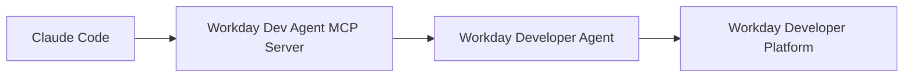

# Workday Developer Agent for Claude

A Claude Code plugin that lets developers use **Workday Developer Agent** from Claude Code.

## Workday Developer Agent

Workday Developer Agent is the premier AI assistant to code custom agents and apps that run in Workday. It enables developers to
build, manage, and upskill all while relying on Workday's agent governance.

## Contents

- **`.mcp.json`** — Uses the `wdcli` to launch an MCP server. This server exposes a `call_workday_developer_agent` tool.
- **`skills/workday-developer-agent/`** - A skill informing Claude about what Workday Developer Agent is, and how it should be used.
- **`hooks/hooks.json`** + **`scripts/session-start-extend.mjs`** - A session start hook that checks if the Claude session has been started in a Workday Extend project and nudges Claude to load the Workday Developer Agent skill.
- **`commands/dev-agent-doctor.md`** + **`scripts/dev-agent-doctor.mjs`** - A `/dev-agent-doctor` command that checks `wdcli` install, MCP support, and sign-in, plus soft checks for the IDE extension.

## How it Works

Workday Developer Agent is exposed to Claude Code via a local MCP server. This server is started and authenticated with the `wdcli`.

## Install (developer setup)

This plugin requires a Workday Developer Platform account. If you do not have an account yet, go to the [Workday Developer Portal](https://developer.workday.com) to get started.

1. Download and install the Workday Developer CLI (`wdcli`) and sign in.
2. Install the Workday Developer Agent extension in VS Code or Cursor and sign in.
3. Install this plugin in Claude Code (via your marketplace or `--plugin-dir` for local use).

Then open an Extend project in the IDE and ask Claude for the change you want — it delegates to the
Developer Agent, and you review/approve in the panel.
